# Experiments with ThreeJS
  

View demos [here](http://experiments.playdo.io/threejs)  
[ possibly some unnecessary code in here. to be cleaned. ]
  
    
***

#### [__01__: Environment map, rotation and translation](http://experiments.playdo.io/threejs/01)
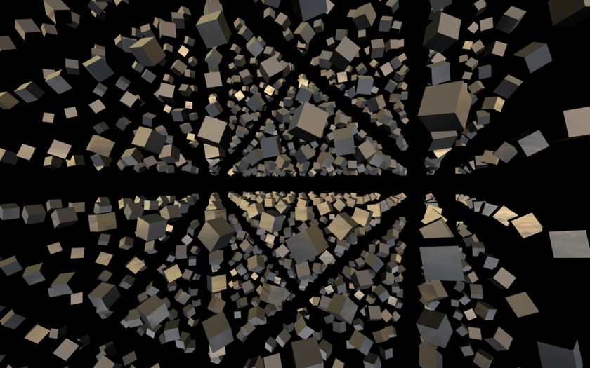

#### [__02__: Shadows, lights](http://experiments.playdo.io/threejs/02)
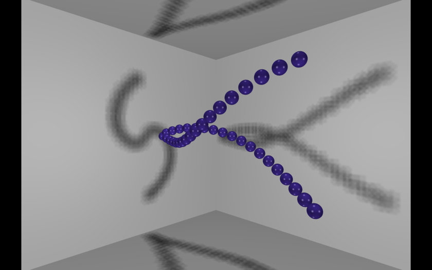

#### [__03__: Mesh deformation, vertex animation](http://experiments.playdo.io/threejs/03)
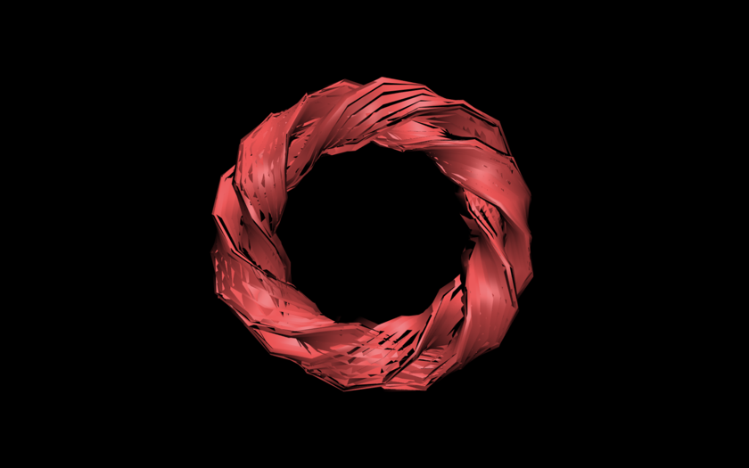

#### [__04__: Vertex and fragment shaders, noise deformation and texturing, orbit controls](http://experiments.playdo.io/threejs/04)
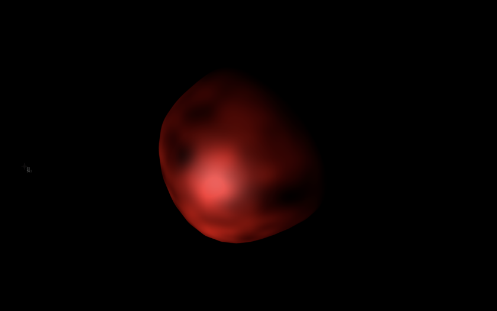

#### [__05__: Loading animated model](http://experiments.playdo.io/threejs/05)
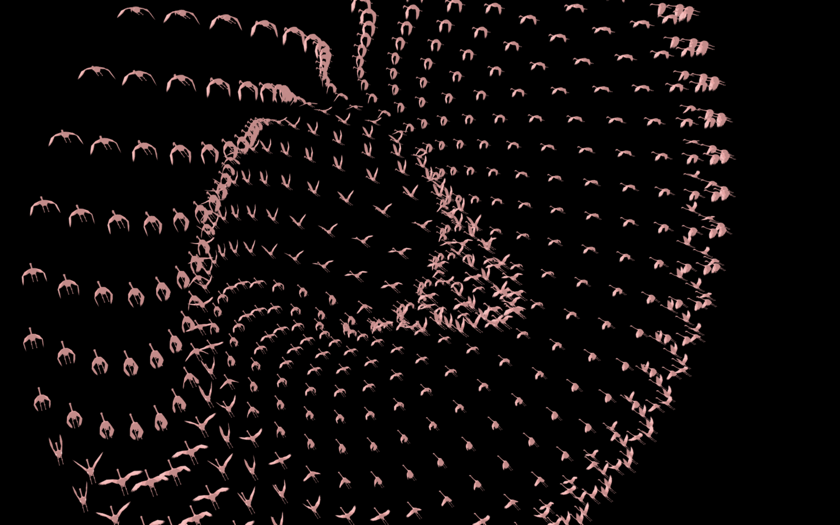

#### [__06__: Vertex colouring, mouse interaction](http://experiments.playdo.io/threejs/06)
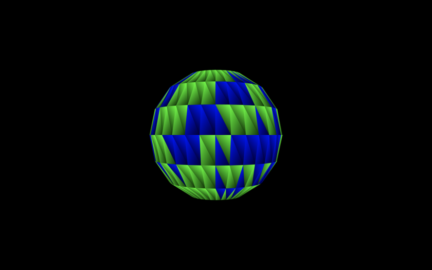

#### [__07__: Depth Material](http://experiments.playdo.io/threejs/07)
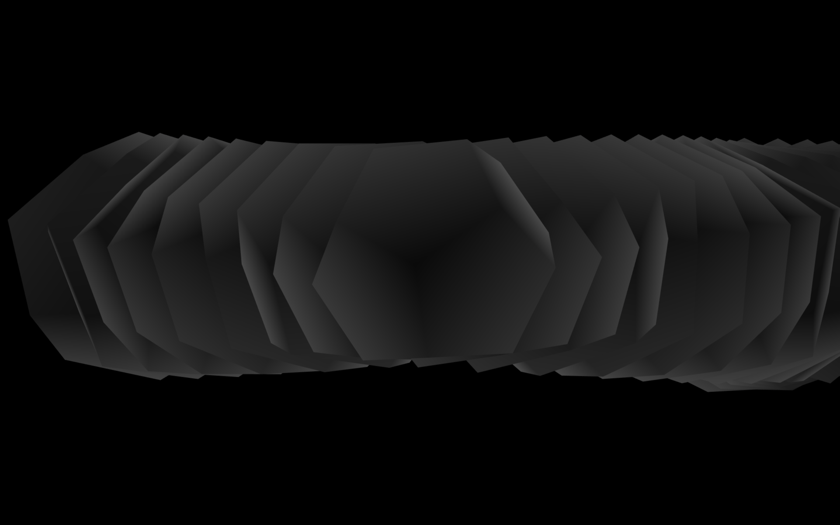

#### [__08__: Animated camera with Tween.js](http://experiments.playdo.io/threejs/08)
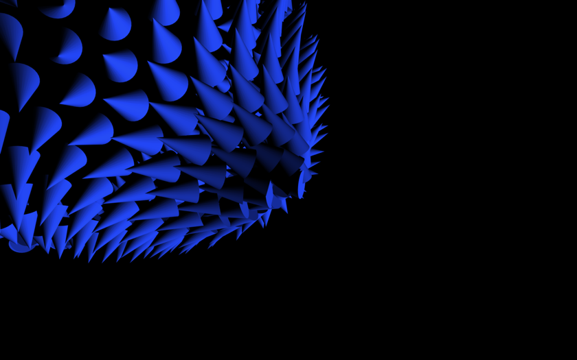

#### [__09__: Object3D](http://experiments.playdo.io/threejs/09)
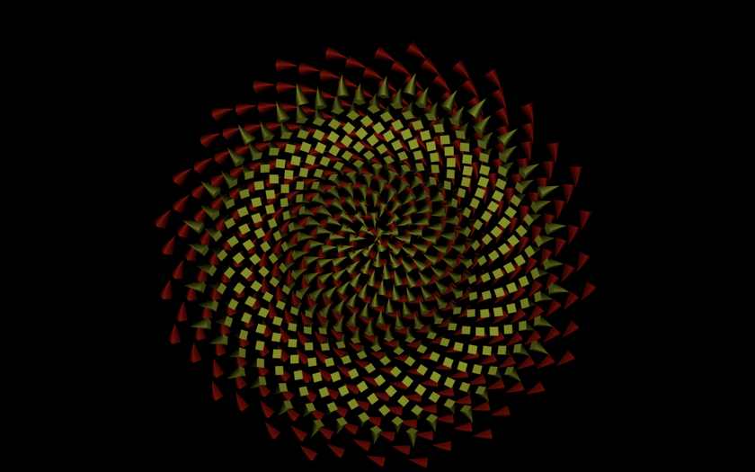

#### [__10__: Terrain, BufferGeometry, fragment shader, Noise](http://experiments.playdo.io/threejs/10)
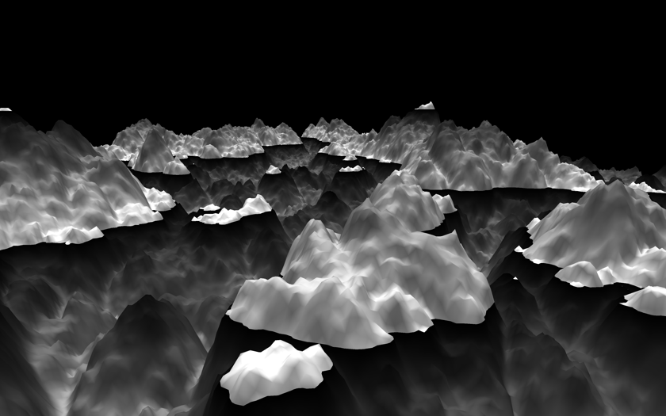

#### [__11__: Terrain, BufferGeometry, vertex and fragment shaders, Noise](http://experiments.playdo.io/threejs/11)
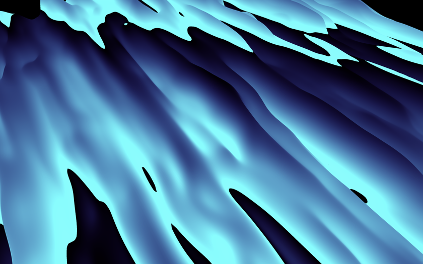

#### [__12__: Terrain, BufferGeometry, vertex and fragment shaders, Noise](http://experiments.playdo.io/threejs/12)
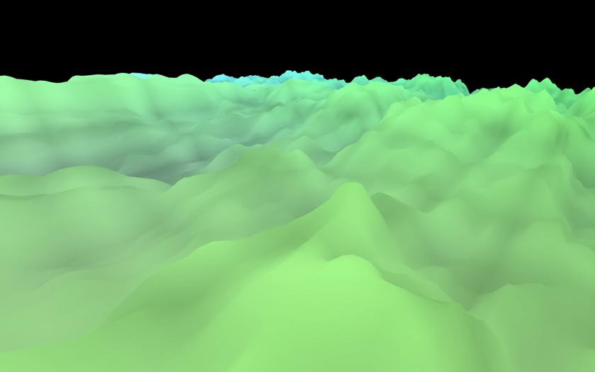

#### [__13__: Phyllotaxis, fragment shader, positioning and animating rotations, Object3D](http://experiments.playdo.io/threejs/13)
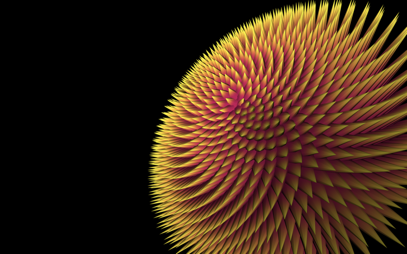

#### [__14__: Spherical coordinates, noise](http://experiments.playdo.io/threejs/14)
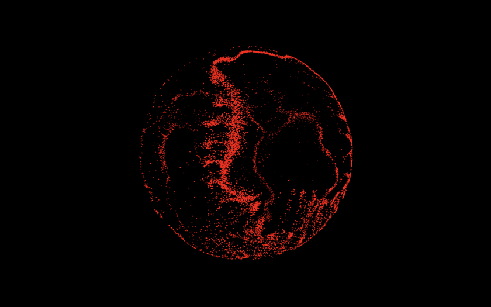

